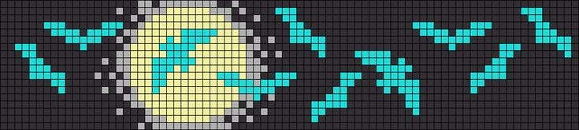
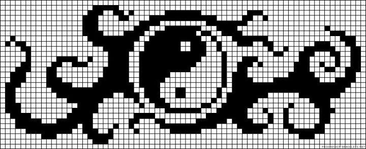

  

# Hi, I'm Uday Maurya

Full-stack developer focused on MERN, TypeScript, and practical web apps.

  
  
  
  
  

---

### About

- Building full-stack web apps with **React, Node.js, Express, and MongoDB**
- Writing TypeScript daily and using Supabase for auth and real-time features
- B.Tech IT student at Parul Institute of Engineering and Technology (2024–27)

---

### 🛠️ Tech Stack

  

---

### 🧩 LeetCode Stats

  

---

### 🔧 Featured Work

**SkinWise**  
Personalized skincare recommendation app — users submit their skin profile and receive tailored product and routine suggestions powered by AI.  
Stack: React · TypeScript · Tailwind CSS · Supabase  
[Live Demo →](https://skin-wise-two.vercel.app/)

**Personal Notes App**  
Full-stack CRUD notes manager with a Node.js + Express backend, MVC architecture, and MongoDB persistence.  
Stack: Node.js · Express · MongoDB · HTML/CSS/JS  
[Live Demo →](https://personal-notes-app-m34h.onrender.com/)

> The source code for these projects is available in my pinned repositories.

---

### 📊 GitHub Stats

  
  

  

---

### 📈 What I'm Working On

- Deepening React patterns — compound components, custom hooks, and cleaner state flows
- Building REST APIs with proper validation, error handling, and middleware chains
- Exploring MongoDB aggregation pipelines for non-trivial queries
- Grinding LeetCode daily to sharpen problem-solving speed

---

### Education & Credentials

- **B.Tech IT** — Parul Institute of Engineering and Technology (2024–27, CGPA 7.66)
- **Diploma IT** — Parul Polytechnic Institute (CGPA 8.73)
- **NPTEL** — Computer Networks & Internet Protocol, IIT Kharagpur (Score: 61%)

  

